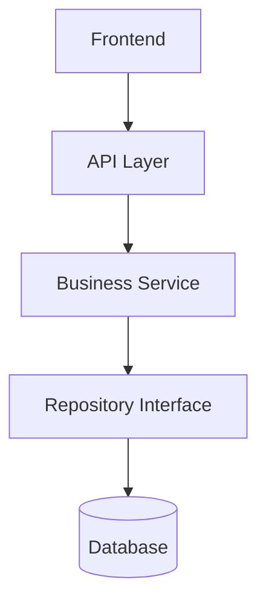
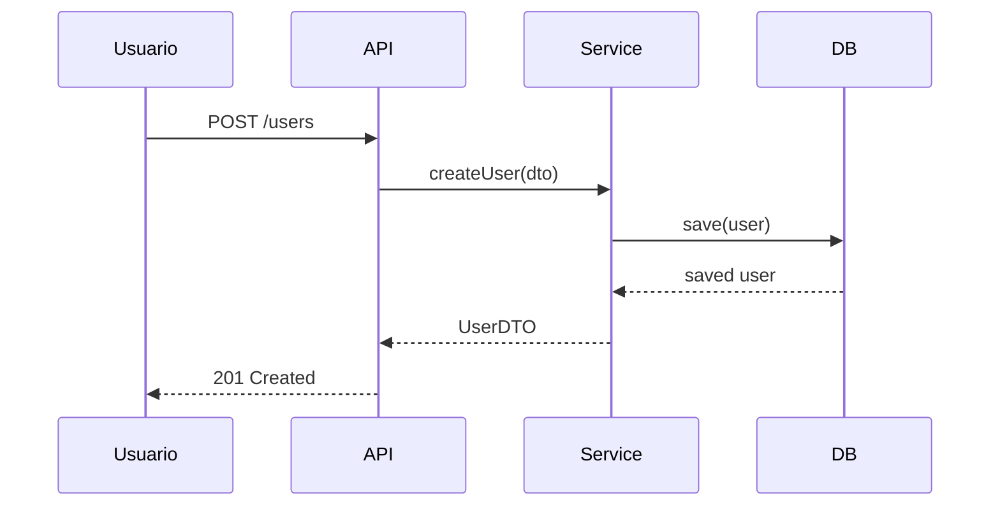

## Cuándo usar

Cuando una decisión de diseño es difícil de entender solo con texto, o cuando el Orquestador pide visualizar la arquitectura.

## Nivel 1 — Diagrama de componentes básico

Usa Mermaid (renderizable en GitHub, GitLab, Notion, Obsidian):

## Nivel 2 — Tipos de diagrama por propósito

| Propósito | Tipo Mermaid |
|-----------|-------------|
| Arquitectura de componentes | `graph TD` / `graph LR` |
| Flujo de un proceso | `flowchart` |
| Secuencia de llamadas | `sequenceDiagram` |
| Modelo de entidades | `erDiagram` |
| Estados de una entidad | `stateDiagram-v2` |

## Nivel 3 — Diagrama de secuencia detallado

Para documentar un flujo con varios actores:

## Restricciones

- Siempre usa Mermaid para garantizar portabilidad (no dependas de herramientas externas)
- El diagrama va en el ADR correspondiente o en `docs/architecture/`
- Un diagrama por concepto; no intentes capturar todo el sistema en uno solo
